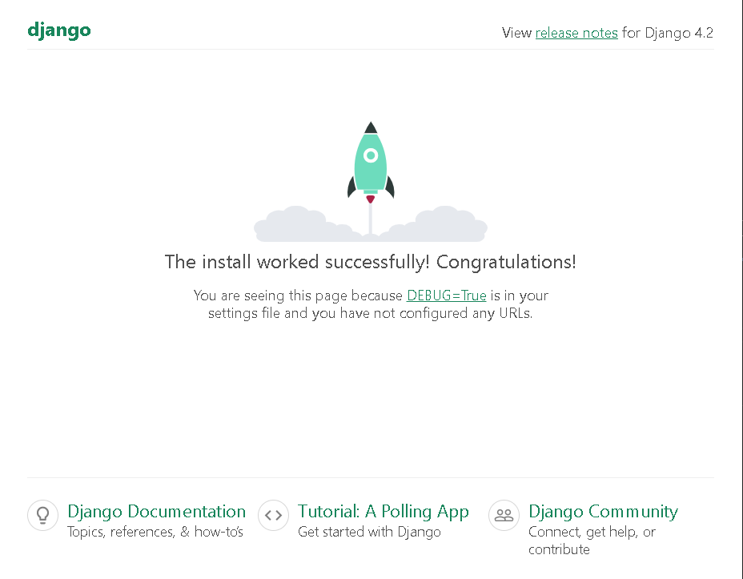

# Using Question Driven Development ideas to create a Django based Python app and have it use APIs. I'm fuzzy on APIs so I want to strengthen that aspect of my knowledge. #
---

## Questions ##

1. **How do I install Django?**
    Django is installed easiest using PIP and the command is 
    
    ```
    pip install django.
    ```

2. **How do I configure Django for work?**
    Since we are building an app, we have to start with a project and then create the site. See [Django Tutorial](https://docs.djangoproject.com/en/4.2/intro/tutorial01/) for more in depth information, but the simplest command is 

    ```
    django-admin startproject <<name of project or site>>
    ```
    Migrate admin, auth, contenttypes, sessions
    ```
    python manage.py migrate
    ```


3. **How do I create the actual app?**
    Change directory to your project folder and run

    ```
    python manage.py startapp <<name of app>>
    ```
    In this case, the apps name is django_api

4. **What does manage.py do?**
    Manage.py in Django is a command-line utility that works similar to the django-admin command. The difference is that it points towards the project’s settings.py file. [Source](https://www.geeksforgeeks.org/custom-django-management-commands/)

5. **After Django is installed, what do I do?**
    Test the Django installation by running the server with a non-default port (Try not to use 8080. 8181 is fine though). Here's the command:
    ```
    python manage.py runserer 8181
    ```
    You should see the following screen.
    

5. **What settings do I configure in Django settings?**

    ALLOWED_HOSTS[] - I set it to '*' inside the bracket while DEBUG=TRUE. 

    DATABASES - > ENGINE. I leave it at the defauult. I switch it to SQL Server or PostGres when I'm closer to release

6. **How do I create the API?**
    We're going to use the REST API from the Django REST Framework

    - [ ] Install the framework using PIP:

        ```
        pipenv install
        djangorestframework
        ```
    - [ ] Update the INSTALLED_APPS
        ```
        django_api,
        'rest_framework'
        ```
    - [ ] Register App URLs in urls.py
        ```
        from django.shortcuts import render
        from rest_framework.response import Response
        from rest_framework.decorators import api_view
         
        # Create your views here.
        @api_view(['GET'])
        def getAPI(request):
            return Response()
        ```
    - [ ] Create the app urls
        ```
        from django.urls import path
        from . import views
        from django.conf import settings
        urlpatterns = [            
            path('', views.getAPI),            
            path('post/', views.postAPI),
        ]
        ```
    - [ ] Create a model for the App
        ```
        from djano.db import models

        # Create your models here.
        class Django_api(models.Model):
            name = models.CharField(max_length = 100)
            description = models.CharField(max_length = 1000)
        ```
    - [ ] Register the model in the app admin.py
        ```
        from djano.contrib import admin
        from .model import Django_api

        # Register your models here.
        admin.site.register(Django_api)
        ```
    - [ ] Make migrations
        ```
        python manage.py makemigrations django_api

        python manage.py migrate
        ```

    


